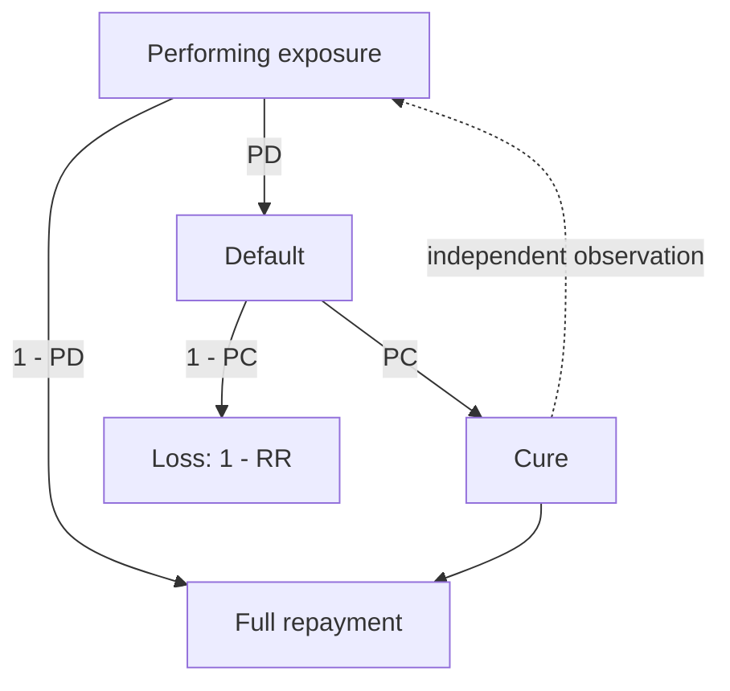
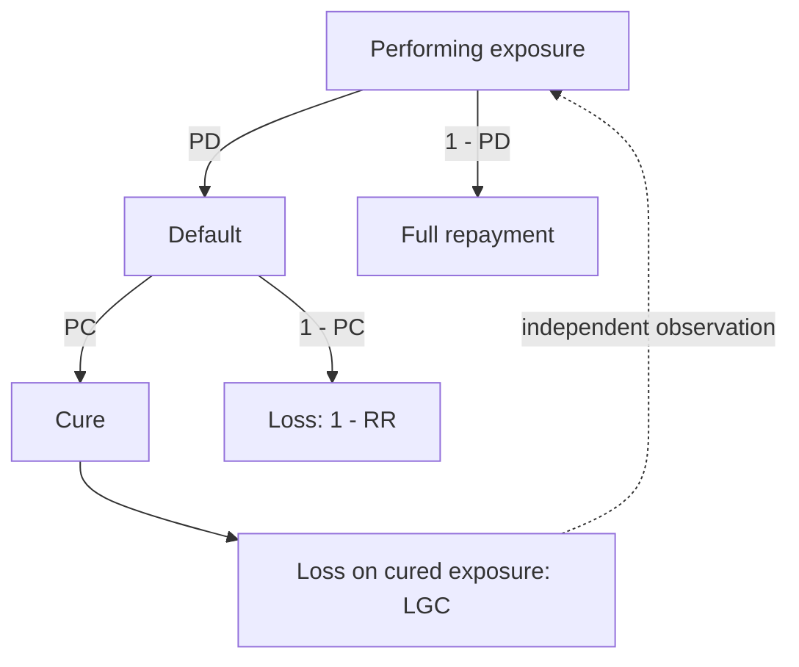
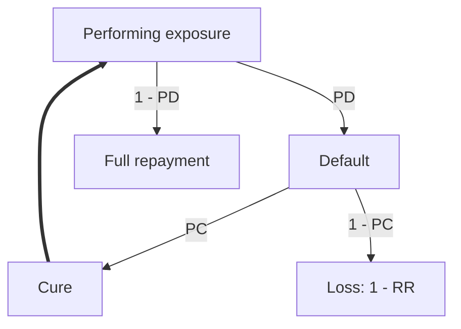

# Deriving the four LGD formulas

This walks through each formula from the underlying cash-flow accounting, independent of any prior implementation, and checks that they collapse to each other correctly at the boundary case.

## Setup

Consider a portfolio of exposures that have defaulted. A fraction `PC` of them cure and return to performing status. Of the cured exposures, a fraction `Prd` re-default before the end of the observation window. Under CRR/EBA GL/2017/16, a re-defaulted exposure is treated as a new, independent default observation, not a continuation of the first one.

`RR` is the recovery rate on exposures that never cure. `RR_brd` is the recovery collected between curing and re-defaulting, for the exposures that do re-default.

## The three modeling approaches

### Basic two-factor model

Treats a cured exposure as if it generates no further loss at all.

The dotted loop back to Performing exposure is what the diagram concedes and the formula below ignores: a cured exposure really does become a new independent observation that can default again, but this formula doesn't account for it numerically.

Only the exposures that never cure contribute loss:

$$LGD = (1-PC)(1-RR)$$

### Loss-given-cure add-on

Acknowledges that cured exposures sometimes still lose value, and adds a flat per-cured-exposure surcharge instead of modeling the mechanism.

The loop back now happens after the LGC loss is realized rather than at the moment of cure, but it's still there and still ignored numerically.

$$LGD_{LGC} = (1-PC)(1-RR) + PC \cdot LGC$$

`LGC` is estimated directly from realized outcomes on the cured population, not derived from the other parameters.

### Re-default-aware model

The only one of the three where the loop back to Performing exposure is the main path rather than a side note the formula ignores. This is the life-cycle picture: a cured exposure genuinely re-enters the performing population as an independent observation, and can default again through the same general mechanism. `Prd` and `RR_brd`, the parameters that turn this picture into a closed-form estimate, belong to the formula below, not to the diagram itself.

Starting from the accounting identity that a re-defaulted exposure gets charged the full `LGD` again, since it re-enters the reference dataset as a new default:

$$LGD = (1-PC)(1-RR) + PC \cdot Prd \cdot LGD$$

Rearranging for `LGD`:

$$LGD(1 - PC \cdot Prd) = (1-PC)(1-RR)$$
$$LGD_{Prd} = \frac{(1-PC)(1-RR)}{1-PC \cdot Prd}$$

This is the naive correction: it fixes the double-counting of cured-then-redefaulted exposures in `PC`, but assumes zero recovery during the cured interval, which throws away real information the `RR_brd` term above is meant to capture.

Crediting that recovery back instead of discarding it:

$$LGD_{new}(1 - PC \cdot Prd) = (1-PC)(1-RR) - PC \cdot Prd \cdot RR_{brd}$$
$$LGD_{new} = \frac{(1-PC)(1-RR) - PC \cdot Prd \cdot RR_{brd}}{1 - PC \cdot Prd}$$

`PC` and `RR` here are the same parameters the basic model already calibrates; nothing about how they're estimated changes. The only new inputs are `Prd` and `RR_brd`, layered on top of an existing pipeline rather than replacing it. That matters because this formula is also the only one of the three that follows an exposure's full lifetime rather than truncating at cure: the basic model stops accounting the moment an exposure cures, and LGC flattens everything that happens afterward into one surcharge with no record of when or how much was recovered. Tracking the interval between cure and re-default explicitly, instead of discarding it, is what keeps this formula aligned with the actual realized cash flow over the exposure's life, and with the regulatory treatment of re-default as a new observation rather than a footnote to the first one.

## Consistency check

Setting `Prd = 0` should collapse both `LGD_Prd` and `LGD_new` back to the basic formula, since with no re-defaults there's nothing left to correct for:

$$LGD_{Prd}\Big|_{Prd=0} = \frac{(1-PC)(1-RR)}{1-0} = (1-PC)(1-RR) = LGD$$
$$LGD_{new}\Big|_{Prd=0} = \frac{(1-PC)(1-RR) - 0}{1-0} = (1-PC)(1-RR) = LGD$$

Both collapse exactly. This is one of the algebraic-identity tests the simulation engine's test suite checks on deterministic inputs.

## The pre-re-default recovery term

`RR_brd` needs a concrete per-exposure value in the simulation, not just a symbol. The approach here treats it as a straight-line amortization proxy: once an exposure cures, it's assumed to resume scheduled payments like a normal performing loan, so the longer it stays cured before falling back into default, the more of the balance has been paid down in the meantime.

For an exposure that cures at time `t_cure` and re-defaults `t_rd` periods later, the elapsed time since the original default is `t_cure + t_rd`. Dividing by the total loan term `T_maturity` gives the fraction of the term that has passed, used here as a stand-in for the fraction of the balance recovered:

$$rr_{before\_rd} = \frac{t_{cure} + t_{rd} - 3}{T_{maturity}}$$

The `-3` subtracts the 90-day arrears window (EBA/GL/2016/07) before an exposure is even recognized as cured, so that window doesn't count toward accrued recovery.

How this combines with the recovery collected once an exposure actually re-defaults, and how that feeds `LGD_true`, is a simulation-side question, not a formula-derivation one - see dgp_assumptions.md's "Recovery rate distributions."