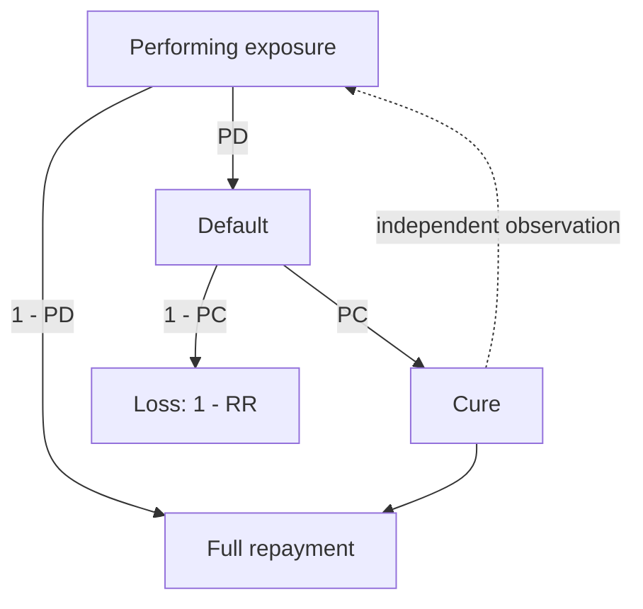
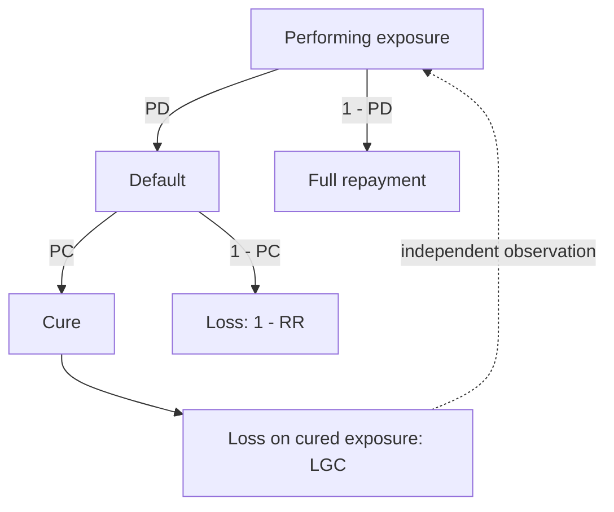
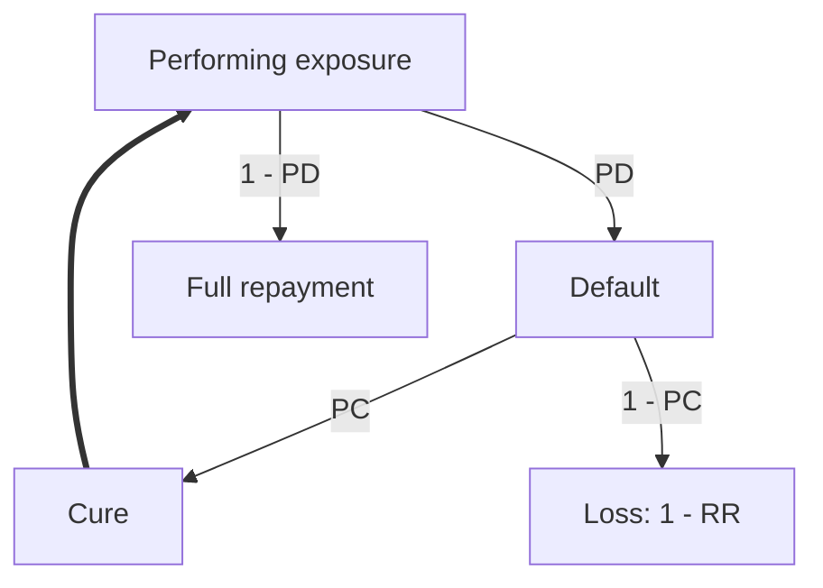

# Deriving the four LGD formulas

This walks through each formula from the underlying cash-flow accounting, independent of any prior implementation, and checks that they collapse to each other correctly at the boundary case.

## Setup

Consider a portfolio of exposures that have defaulted. A fraction $PC$ of them cure and return to performing status. Of the cured exposures, a fraction $P_{rd}$ re-default before the end of the observation window. Under EBA/GL/2017/16 §101, a re-defaulted exposure is treated as a new, independent default observation, not a continuation of the first one, provided the re-default happens nine months or more after the return to non-defaulted status; the formulas below assume that condition holds (see `dgp_assumptions.md`'s "Re-default independence: the nine-month merge rule" for what happens when it doesn't).

$RR$ is the recovery rate on exposures that never cure. $RR_{brd}$ is the recovery collected between curing and re-defaulting, for the exposures that do re-default.

## The three modeling approaches

### Basic two-factor model

Treats a cured exposure as if it generates no further loss at all.

The dotted loop back to Performing exposure is what the diagram concedes and the formula below ignores: a cured exposure really does become a new independent observation that can default again, but this formula doesn't account for it numerically.

Only the exposures that never cure contribute loss:

$$LGD = (1-PC)(1-RR)$$

### Loss-given-cure add-on

Acknowledges that cured exposures sometimes still lose value, and adds a flat per-cured-exposure surcharge instead of modeling the mechanism.

The loop back now happens after the LGC loss is realized rather than at the moment of cure, but it's still there and still ignored numerically.

$$LGD_{LGC} = (1-PC)(1-RR) + PC \cdot LGC$$

$LGC$ is estimated directly from realized outcomes on the cured population, not derived from the other parameters.

### Re-default-aware model

The only one of the three where the loop back to Performing exposure is the main path rather than a side note the formula ignores. This is the life-cycle picture: a cured exposure genuinely re-enters the performing population as an independent observation, and can default again through the same general mechanism. $P_{rd}$ and $RR_{brd}$, the parameters that turn this picture into a closed-form estimate, belong to the formula below, not to the diagram itself.

Consider a reference dataset built from $N$ original defaulted exposures. Starting from the naive case, with zero recovery assumed during the cured interval: a cured-then-redefaulted exposure gets charged the full $LGD$ again on re-entry, since it re-enters the reference dataset as a new, independent default under EBA/GL/2017/16 §101:

$$LGD = (1-PC)(1-RR) + PC \cdot P_{rd} \cdot LGD$$

Rearranging for $LGD$:

$$LGD(1 - PC \cdot P_{rd}) = (1-PC)(1-RR)$$
$$LGD_{Prd} = \frac{(1-PC)(1-RR)}{1-PC \cdot P_{rd}}$$

This is the naive correction: it fixes the double-counting of cured-then-redefaulted exposures in $PC$, but assumes zero recovery during the cured interval, which throws away real information the $RR_{brd}$ term is meant to capture.

Crediting that recovery back requires more care than a flat subtraction, because the credit reduces the *balance* a redefaulted exposure carries into its fresh loss, not the portfolio-level $LGD$ directly. Under EBA/GL/2017/16 §101 (assuming every re-default here clears the nine-month independence threshold), a cohort where $N_c$ exposures cure and $N_{rd}$ of those re-default produces $N + N_{rd}$ logged reference-dataset observations, not $N$, since each re-default is logged as its own observation. $PC$ and $P_{rd}$ are calibrated against that inflated count:

$$PC = \frac{N_c}{N + N_{rd}}, \qquad P_{rd} = \frac{N_{rd}}{N_c}$$

A never-cured exposure contributes loss $(1-RR)$ on its $ead$ (its exposure at default). A cured-and-never-redefaulted exposure contributes zero. A redefaulted exposure has its balance paid down at rate $RR_{brd}$ during the cured interval, and then the *remaining* balance is charged the same fresh loss rate a first default faces: recovery applies to what's left of the exposure, not to the original balance, so the two combine multiplicatively rather than by subtraction:

$$\text{loss (redefaulted)} = (1 - RR_{brd})(1-RR)$$

Total loss across the $N$ real exposures (never-cured plus redefaulted; cured-and-never-redefaulted contribute nothing):

$$LGD_{new} \cdot N = (N - N_c)(1-RR) + N_{rd}(1-RR_{brd})(1-RR)$$

Substituting $N_c = PC(N+N_{rd})$ and $N_{rd} = \frac{PC \cdot P_{rd} \cdot N}{1 - PC \cdot P_{rd}}$, both following directly from the two definitions above, and dividing through by $N$:

$$LGD_{new} = \frac{(1-RR)\big[(1-PC) - PC \cdot P_{rd} \cdot RR_{brd}\big]}{1 - PC \cdot P_{rd}}$$

This requires the same recovery rate $RR$ to apply to a first default and to the fresh loss a redefaulted exposure faces after its $RR_{brd}$ credit. `dgp_assumptions.md`'s "Recovery rate distributions" section already states this assumption explicitly as load-bearing, not an incidental detail.

$PC$ and $RR$ here are the same parameters the basic model already calibrates; nothing about how they're estimated changes. The only new inputs are $P_{rd}$ and $RR_{brd}$, layered on top of an existing pipeline rather than replacing it. That matters because this formula is also the only one of the three that follows an exposure's full lifetime rather than truncating at cure: the basic model stops accounting the moment an exposure cures, and LGC flattens everything that happens afterward into one surcharge with no record of when or how much was recovered. Tracking the interval between cure and re-default explicitly, instead of discarding it, is what keeps this formula aligned with the actual realized cash flow over the exposure's life, and with the regulatory treatment of re-default as a new observation rather than a footnote to the first one. $LGD_{Prd}$ above is exactly this formula's $RR_{brd} = 0$ special case: with no balance left to credit, the multiplicative-vs-additive distinction disappears.

## Consistency check

Setting $P_{rd} = 0$ should collapse both $LGD_{Prd}$ and $LGD_{new}$ back to the basic formula, since with no re-defaults there's nothing left to correct for:

$$LGD_{Prd}\Big|_{P_{rd}=0} = \frac{(1-PC)(1-RR)}{1-0} = (1-PC)(1-RR) = LGD$$
$$LGD_{new}\Big|_{P_{rd}=0} = \frac{(1-PC)(1-RR) - 0}{1-0} = (1-PC)(1-RR) = LGD$$

Both collapse exactly. This is one of the algebraic-identity tests the simulation engine's test suite checks on deterministic inputs.

## The pre-re-default recovery term

$RR_{brd}$ needs a concrete per-exposure value in the simulation, not just a symbol. The approach here treats it as a straight-line amortization proxy: once an exposure cures, it's assumed to resume scheduled payments like a normal performing loan, so the longer it stays cured before falling back into default, the more of the balance has been paid down in the meantime.

For an exposure that cures at time $t_{cure}$ and re-defaults $t_{rd}$ periods later, the elapsed time since the original default is $t_{cure} + t_{rd}$. Dividing by the total loan term $T_{maturity}$ gives the fraction of the term that has passed, used here as a stand-in for the fraction of the balance recovered:

$$rr_{brd} = \frac{t_{cure} + t_{rd} - 3}{T_{maturity}}$$

The $-3$ subtracts the 90-day arrears window (EBA/GL/2016/07) before an exposure is even recognized as cured, so that window doesn't count toward accrued recovery.

How this combines with the recovery collected once an exposure actually re-defaults, and how that feeds $LGD_{true}$ (the realized portfolio-level loss ratio, computed directly from simulated cash flows rather than from any of the four formulas above), is a simulation-side question, not a formula-derivation one - see `dgp_assumptions.md`'s "Recovery rate distributions."

## A segmented variant: relaxing the shared-recovery assumption

$LGD_{new}$'s derivation above requires the same recovery rate $RR$ to apply to a first default and to a redefaulted exposure's fresh loss after its $RR_{brd}$ credit. If redefault recovery instead follows its own distribution, $RR_{ard} \neq RR$, the formula has no way to represent that: it has exactly one $RR$ term, no second slot for a different rate. A variant that keeps the same structure but lets the redefault-loss term use its own rate needs only one change to the derivation above:

$$LGD_{new} \cdot N = (N - N_c)(1-RR) + N_{rd}(1-RR_{brd})(1-RR) \quad\longrightarrow\quad LGD_{adj} \cdot N = (N - N_c)(1-RR) + N_{rd}(1-RR_{brd})(1-RR_{ard})$$

Substituting the same $N_c$ and $N_{rd}$ identities established above and dividing through by $N$:

$$LGD_{adj} = \frac{\big(1 - PC - PC \cdot P_{rd}\big)(1-RR) + PC \cdot P_{rd}(1-RR_{brd})(1-RR_{ard})}{1 - PC \cdot P_{rd}}$$

### Consistency check

Three boundary cases collapse $LGD_{adj}$ back to formulas already derived above:

$$LGD_{adj}\Big|_{RR_{ard}=RR} = \frac{(1-RR)\big[(1 - PC - PC \cdot P_{rd}) + PC \cdot P_{rd}(1-RR_{brd})\big]}{1 - PC \cdot P_{rd}} = \frac{(1-RR)\big[(1-PC) - PC \cdot P_{rd} \cdot RR_{brd}\big]}{1 - PC \cdot P_{rd}} = LGD_{new}$$
$$LGD_{adj}\Big|_{RR_{ard}=RR,\ RR_{brd}=0} = \frac{(1-PC)(1-RR)}{1 - PC \cdot P_{rd}} = LGD_{Prd}$$
$$LGD_{adj}\Big|_{P_{rd}=0} = (1-PC)(1-RR) = LGD$$

All three collapse exactly. These are among the algebraic-identity tests the simulation engine's test suite checks on deterministic inputs.