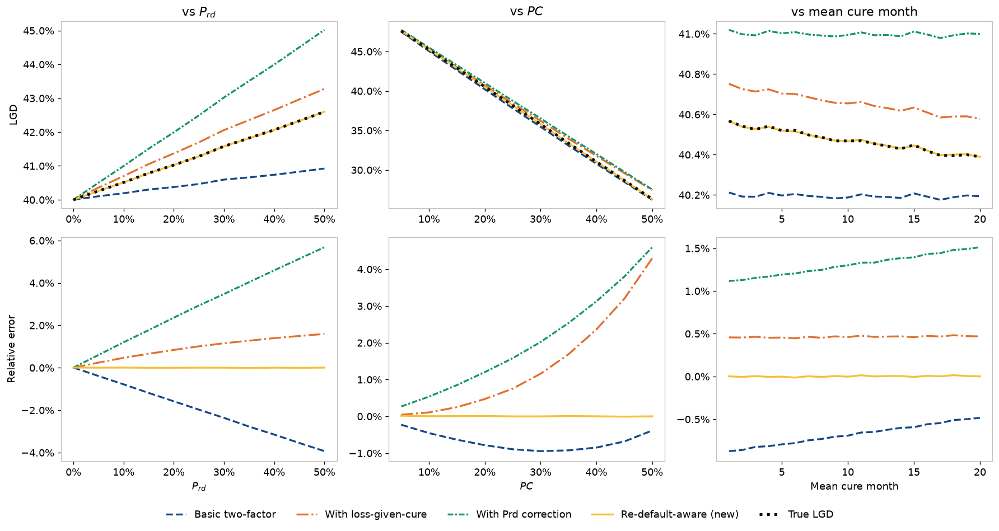
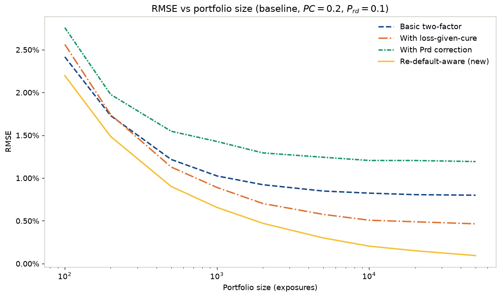
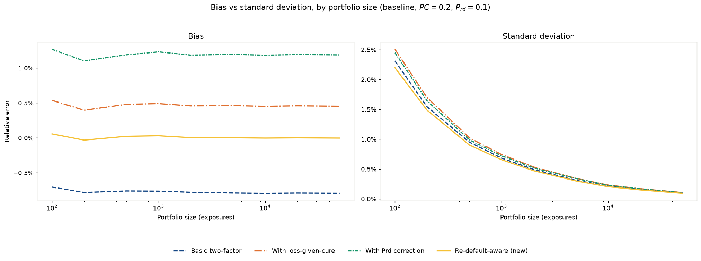
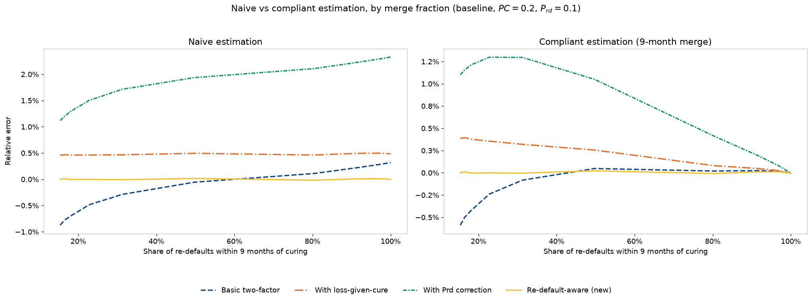
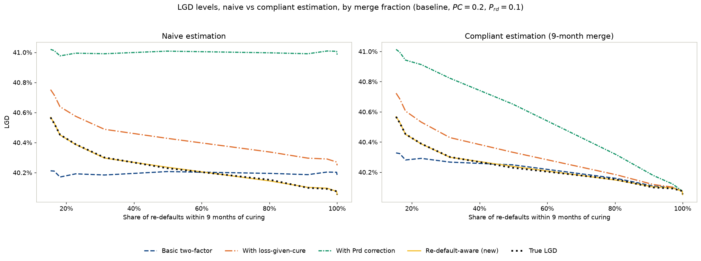
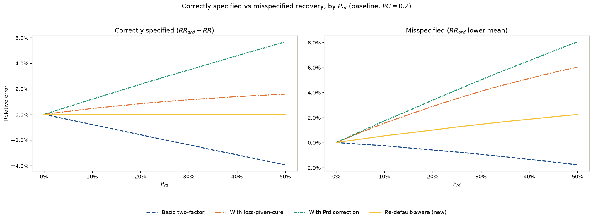
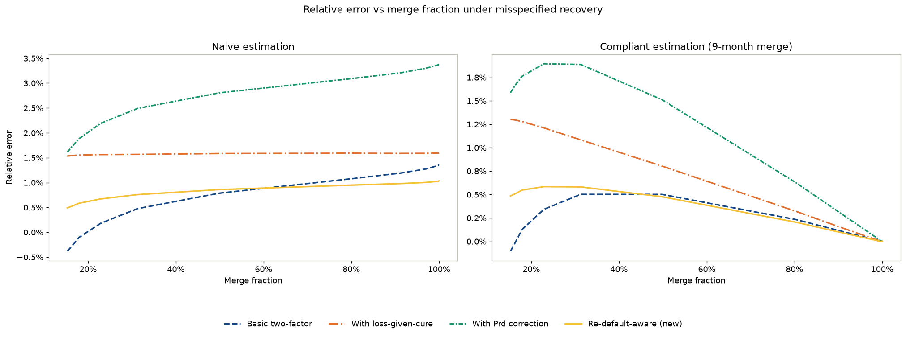
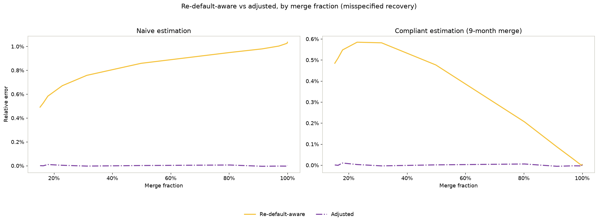
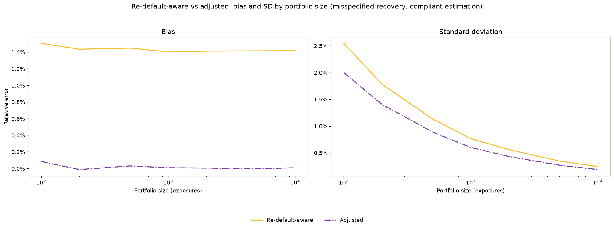

# Results

Five LGD formulas are compared across four experiments: the [basic two-factor model](derivation.md#basic-two-factor-model), the [loss-given-cure add-on](derivation.md#loss-given-cure-add-on), the naive Prd-correction ($LGD_{Prd}$), the [re-default-aware model](derivation.md#re-default-aware-model) ($LGD_{new}$), and its [segmented variant](derivation.md#a-segmented-variant-relaxing-the-shared-recovery-assumption) ($LGD_{adj}$). Full derivations are in [`derivation.md`](derivation.md); every DGP and estimation assumption behind the numbers below is in [`dgp_assumptions.md`](dgp_assumptions.md). Each section links to the notebook that produced it; the code and every intermediate cell are there, not reproduced here.

## Baseline bias

[`01_baseline_sensitivity.ipynb`](../notebooks/01_baseline_sensitivity.ipynb) sweeps $P_{rd}$, $PC$, and mean cure month independently, holding the rest at the base case ($PC \approx 0.2$, $P_{rd} \approx 0.1$).

The re-default-aware formula's bias stays within noise of zero across all three sweeps. The other three diverge in different directions and at different rates: at $P_{rd}=0.5$ the basic formula underestimates by 3.93%, the loss-given-cure add-on overestimates by 1.59%, and the Prd-correction overestimates by 5.68%. Sweeping $PC$ instead produces the same qualitative ranking, with one difference in shape: the basic formula's error is a U-curve, bottoming out around -0.95% near $PC=30\%$ before recovering to -0.39% at $PC=50\%$, rather than drifting monotonically.

Mean cure month affects the formulas far less than either probability sweep, and through a different mechanism: $LGD_{true}$ itself drifts down as mean cure month grows, because the recovery credited before re-default is a linear function of elapsed time, so the longer an exposure stays cured before re-defaulting, the more of its balance is already paid down. The basic and Prd-correction formulas' own predictions stay essentially flat as this happens, since neither uses that pre-re-default recovery term, so their error drifts visibly as the target moves underneath them rather than their own prediction moving with it. The loss-given-cure and re-default-aware formulas' errors both stay flat instead, but for different reasons: loss-given-cure is estimated empirically from realized losses on cured exposures, so it absorbs the same shift $LGD_{true}$ does without needing an explicit term for it, at its own separate nonzero baseline bias of about +0.45% to +0.48%. The re-default-aware formula is the only one with an explicit pre-re-default recovery term, so its prediction tracks the shift directly, at a baseline of zero rather than loss-given-cure's nonzero one.

*All three baseline sweeps, error and levels together. Answers research goal 1: under a correctly specified DGP, how much do the basic, loss-given-cure, and Prd-correction formulas diverge from the re-default-aware one, and how does the gap move with $P_{rd}$, $PC$, and cure timing.*

One caveat applies to all three sweeps above: the re-default-aware formula was derived from the same cash-flow accounting identity $LGD_{true}$ is computed from in this simulation, so recovering it almost exactly here is partly a check that the algebra and the code agree with each other, not solely independent evidence the formula will outperform on a real, un-simulated portfolio. The more informative result of this experiment is the other three formulas' bias, direction, magnitude, and the mechanisms driving each.

## Complexity vs. robustness tradeoff

[`02_complexity_robustness_tradeoff.ipynb`](../notebooks/02_complexity_robustness_tradeoff.ipynb) sweeps portfolio size from 100 to 50,000 exposures at the base case, asking whether the re-default-aware formula's extra parameters ($P_{rd}$, $RR_{brd}$) ever cost more in estimation variance than they save in structural bias.

They never do. The re-default-aware formula has the lowest RMSE of all four formulas at every portfolio size tested, and decomposing RMSE into bias and standard deviation shows why: each formula's bias settles into a flat, sample-size-independent floor from about 500 exposures upward (basic around -0.79%, loss-given-cure around +0.45%, Prd-correction around +1.19%, re-default-aware near 0%), while standard deviation shrinks with portfolio size for all four at a similar rate, with the re-default-aware formula's SD the smallest throughout. The mechanism is structural: both of the re-default-aware formula's correction terms are multiplied by $P_{rd}$, so a replication with zero observed re-defaults collapses it exactly to the basic estimate rather than picking up noise from an unstable $P_{rd}$ or $RR_{brd}$ estimate. At the smallest size tested (100 exposures), 130 of 1,000 replications drew zero re-defaults, and every formula's prediction matched exactly in each one.

This result doesn't rule out a bias-variance tradeoff appearing under a misspecified DGP, where the re-default-aware formula's lower bias, and the variance advantage that comes with it here, are no longer guaranteed. That's tested directly in the [misspecification experiment](#misspecification-stress-test) below, under a correctly specified DGP throughout this one.

*RMSE vs. portfolio size, all four formulas. Answers research goal 2: at what reference-dataset size does the more complex formula's estimation variance offset its lower bias.*

*Bias/variance decomposition confirming the re-default-aware formula's RMSE advantage is a pure bias effect, not a bias-for-variance trade.*

## Reference-dataset construction: the nine-month merge rule

[`03_reference_dataset_construction.ipynb`](../notebooks/03_reference_dataset_construction.ipynb) tests a data-construction question distinct from the other three experiments: does the reference dataset correctly apply EBA/GL/2017/16 §101, merging a re-default within nine months of curing into the original default rather than logging it as a second independent observation? The DGP itself stays correctly specified throughout; mean cure month is swept only to produce a range of merge fractions.

Naive estimation counts every re-default as its own independent observation regardless of timing, exactly the treatment the baseline and complexity experiments use throughout. Compliant estimation instead excludes a re-default from the cured and re-defaulted counts if it happened within nine months of curing, and folds that whole cure-to-re-default episode into the same recovery-rate pool as a genuine first default.

Under naive estimation, none of the four formulas converge as the merge fraction grows: the basic formula's bias drifts from -0.87% to +0.32%, and the Prd-correction's climbs the whole way from +1.12% to +2.32%, both driven by naive estimation's blindness to how much genuinely independent re-default is actually left. Under compliant estimation, all four formulas converge to about -0.01% as the merge fraction approaches 100%, the point at which compliant estimation correctly finds zero independent re-defaults left and every formula collapses to the basic two-factor identity. The re-default-aware formula stays close to zero under both regimes, but not perfectly: a targeted stress configuration ($P_{rd}=0.3$, mean cure month 40, chosen to push a large share of re-defaults under the threshold) isolates a small residual bias of +0.070% under compliant estimation (naive: -0.010%, indistinguishable from noise).

The residual traces to a genuine population mismatch, visible directly in the underlying recovery draws at that stress configuration: never-cured exposures average a recovery rate of 0.5002, matching the underlying distribution, and genuinely independent re-defaults average 0.4946, the same distribution, which is exactly why naive pooling of those two groups doesn't bias the formula in the first place. A merged exposure's combined recovery averages 0.8610, far higher, because it compounds two positive recovery components, the accrued paydown before merging plus a fresh recovery on top of that, instead of drawing from a single distribution. Compliant estimation has nowhere else to put a merged exposure's recovery except into the same pool used for genuine first defaults, since the re-default-aware formula only has one recovery-rate input, and that pool's mean shifts once it's diluted with something the underlying distribution never accounted for. This residual doesn't survive to a 100% merge fraction: at that extreme every re-default is merged, so there's no genuinely independent re-default population left for the pooling mismatch to bite on. It shows up specifically in the partial range, where some re-defaults are merged and some aren't.

*Naive vs. compliant merge-rule estimation, by merge fraction. Answers research goal 3: whether the reference dataset itself, not just the formula, is built correctly under EBA/GL/2017/16 §101.*

*The same comparison in raw LGD levels rather than relative error.*

## Misspecification stress test

[`04_misspecification_stress_test.ipynb`](../notebooks/04_misspecification_stress_test.ipynb) breaks the re-default-aware formula's one load-bearing assumption on purpose: that recovery after re-default follows the same distribution as first-default recovery. Recovery after re-default is redrawn from a lower-mean distribution and compared against the same $P_{rd}$ sweep as the baseline experiment.

The reversal is immediate and severe. By $P_{rd}=0.1$ the re-default-aware formula's bias has grown to +0.54%; by $P_{rd}=0.5$ it reaches +2.24%, larger in magnitude than the basic formula's -1.77% at the same point, the formula built to improve on the basic model performing worse than it under this specific misspecification. It stays well ahead of the other two: the loss-given-cure formula reaches +6.03% and the Prd-correction +8.05% at the same point, so the reversal is specifically against the basic model it was designed to beat, not a change to the overall ranking. The basic formula's own bias actually shrinks under misspecification rather than growing, since its pooled recovery estimate partially absorbs the lower re-default recovery along with the now-lower $LGD_{true}$ it's being measured against.

*Correctly specified vs. misspecified recovery-after-redefault, by $P_{rd}$. Answers research goal 4: does the re-default-aware formula's advantage survive when the data is generated under a broken assumption that first-default and redefault recovery rates are equal.*

Rerunning the merge-fraction sweep from the reference-dataset-construction experiment under the same misspecification shows the two effects don't simply compound, for any of the four formulas. Under naive estimation, the basic formula's bias still crosses from negative to positive as the merge fraction grows, from -0.38% to +1.36%, but shifted up relative to the correctly specified case; the loss-given-cure formula's stays essentially flat around +1.5% to +1.6% across the whole range; the Prd-correction's climbs from +1.6% to +3.4%. The re-default-aware formula's own naive-regime bias grows steadily with the merge fraction too, from +0.49% at a 15% merge fraction to +1.04% near-universal merging, overtaking the basic formula's naive bias somewhere past the halfway point of the range. Under compliant estimation the ranking changes again: the basic formula's bias now peaks around +0.50% near a 30-40% merge fraction before falling back toward zero rather than staying near zero throughout, the Prd-correction's peaks near +1.9% around a 25% merge fraction before falling back, the loss-given-cure formula's falls steadily from +1.3% to zero, and the re-default-aware formula's peaks around +0.58% near the same 25% merge fraction as the Prd-correction before falling back below +0.01%, the same protective mechanism found in the merge-rule experiment surviving the added misspecification largely intact. All four formulas converge back toward zero as the merge fraction approaches 100%, the same convergence the correctly specified merge-rule experiment found.

*Naive vs. compliant estimation under misspecified recovery, by merge fraction, all four original formulas. Whether the merge-rule residual and the recovery misspecification compound.*

The [segmented variant](derivation.md#a-segmented-variant-relaxing-the-shared-recovery-assumption) derived in response removes the bias entirely: its error stays at noise level (within ±0.01%) across the full merge-fraction range, under both naive and compliant estimation, everywhere the unmodified re-default-aware formula's bias otherwise grows. It does this by drawing on two separate calibration pools instead of the single pooled recovery rate the other formulas share: a homogeneous pool combining never-cured exposures with merged exposures' compound recovery, and an independent-redefault pool built only from re-defaults that clear the nine-month threshold ([`dgp_assumptions.md`, "Estimating formula inputs from the simulated data"](dgp_assumptions.md#estimating-formula-inputs-from-the-simulated-data)). Reusing the plain pooled rate instead, the same one the other four formulas use, wouldn't work: that rate already mixes recovery from all three populations, so plugging it into a formula that also has an explicit redefault-recovery term would double-count the same misspecified distribution, once through the contaminated pooled rate and once through the explicit term. Crediting merged exposures to the homogeneous pool, rather than excluding them from calibration entirely, matters in its own right: an earlier version of this fix that left merged exposures out of both pools developed a bias of its own under compliant estimation, growing to +2.25% at a full merge fraction, worse than the unmodified formula above roughly a 40% merge fraction. Folding merged exposures' compound recovery into the homogeneous pool, mirroring how the plain pooled rate already treats them, is what keeps the segmented variant's error at noise level under both regimes, not just the naive one.

*The segmented variant's bias against the unmodified formula's, across the same merge-fraction range, both naive and compliant estimation.*

It also holds at smaller portfolio sizes: the independent-redefault pool the segmented variant draws on shrinks along with the observation count as the merge fraction grows, raising the question of whether that shrinkage introduces a bias of its own at small $n$. Sweeping portfolio size from 100 to 10,000 exposures at a stress configuration with a high merge fraction (about 50%) finds no such bias: the segmented variant's error stays within noise (-0.01% to +0.09%) at every size tested, under both naive and compliant estimation, with no trend as the portfolio shrinks. What does move with portfolio size is the standard deviation, from about 2.0% at 100 exposures down to about 0.19% at 10,000, the same shrinking-estimation-variance pattern the complexity experiment found for the four original formulas. The unmodified re-default-aware formula's own bias, by contrast, stays essentially flat across the whole range (around +2.4% naive, +1.4% compliant), a structural bias from the wrong recovery assumption rather than something more data averages away.

*Bias and standard deviation of the re-default-aware formula against its segmented variant, by portfolio size, at a stress configuration with a high merge fraction, compliant estimation.*
